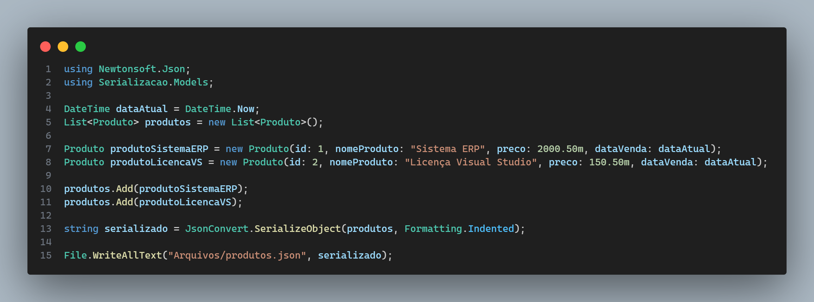

# Serialização no Csharp/.NET

A serialização JSON em C# é o processo de transformar objetos em C# em uma representação de string no formato JSON. Isso é útil quando você precisa enviar dados pela rede ou armazená-los de forma persistente.

Aqui está um exemplo simples de como você pode serializar um objeto em C# usando a biblioteca Newtonsoft.Json:

Neste exemplo, criamos uma classe Produtos com quatro propriedades, Id, Nome Produto, Preço e Data de venda. Em seguida, criamos uma instância dessa classe e a serializamos para JSON usando o método JsonConvert.SerializeObject(). O resultado será uma string JSON que representa o objeto exemplo.

Por favor, note que este é um exemplo básico. A serialização JSON em C# pode se tornar muito mais complexa quando você está lidando com tipos de dados mais complexos e estruturas de dados aninhadas.

